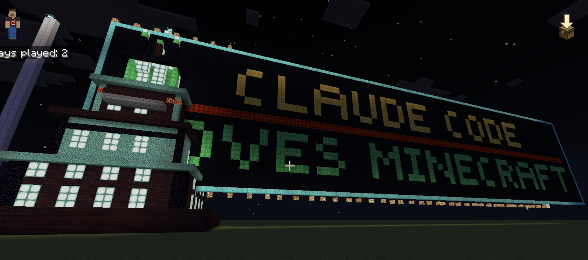

# Claud-Craft

A [Claude Code](https://github.com/anthropics/claude-code) skill that turns natural language into ready-to-paste **MakeCode Python** scripts for **Minecraft Education Edition**.

Describe what you want to build, and Claude generates the code. Paste it into Minecraft, type `1` — done.




*Luigi's Mansion and a pixel-art sign — both generated with `/minecraft-builder`*

## The `/minecraft-builder` Skill

The core of this repo is a Claude Code [custom slash command](https://docs.anthropic.com/en/docs/claude-code/tutorials#create-custom-slash-commands) that knows the full MakeCode Python API, block palette, platform limitations, and advanced building techniques.

### Install

Clone this repo and Claude Code will automatically pick up the skill:

```bash
git clone https://github.com/aviv4339/claud-craft.git
cd claud-craft
```

The skill lives at `.claude/commands/minecraft-builder.md` — Claude Code loads it automatically when you work from this directory.

### Use

Inside Claude Code, just type:

```
/minecraft-builder a pirate ship with cannons and sails
```

Claude will generate a complete MakeCode Python script. Then:

1. Open **Minecraft Education Edition**
2. Press **C** to open Code Builder
3. Switch to **Python** mode
4. Paste the script and click **Run**
5. Type **`1`** in the game chat

### What the Skill Knows

The skill prompt (`.claude/commands/minecraft-builder.md`) teaches Claude:

- **Full MakeCode Python API** — agent control, `blocks.fill()`, `blocks.place()`, player events, mobs
- **Complete block palette** — 80+ verified block names organized by category
- **Platform limitations** — no `str()`, no `len()`, no dicts, no tuple unpacking, no `nonlocal`, and more
- **Advanced techniques** — circles, spheres, domes, spirals, arches, pixel art, collision avoidance
- **Quality standards** — impressive scale, material variety, architectural detail, lighting

### Examples

```
/minecraft-builder a treehouse village connected by bridges
/minecraft-builder a Roman colosseum with arches and columns
/minecraft-builder a pixel art creeper face
/minecraft-builder a roller coaster track
/minecraft-builder a medieval castle with towers and a drawbridge
```

## Example Builds

Every script in this repo was generated using the skill:

| Script | What it builds | Method |
|--------|---------------|--------|
| `colorful_pyramid.py` | Rainbow pyramid spiraling in gold, diamond, emerald & iron, topped with a beacon | Agent-based |
| `sports_car.py` | Red sports car with glass windows, glowstone headlights & redstone taillights | `blocks.fill()` |
| `luigis_mansion.py` | Luigi's Mansion — 4 shrinking floors + crown spire with beacon top | `blocks.fill()` |
| `pixel_sign.py` | Giant pixel-art sign: "CLAUDE CODE / LOVES MINECRAFT" with diamond border | `blocks.fill()` |

## Running the Scripts

For **agent-based** scripts (like `colorful_pyramid.py`):
1. Open your inventory and place the **Agent** in the world
2. Press **C**, switch to Python, paste, run, type `1`

For **`blocks.fill()`** scripts (everything else):
1. Stand still — no agent needed
2. Press **C**, switch to Python, paste, run, type `1`

> **Tip:** Tall builds like Luigi's Mansion build 25 blocks away from the player so you can watch without getting pushed around.

## MakeCode Python Quick Reference

MakeCode Python is a subset of standard Python with some quirks:

### Two APIs

**Agent API** — the agent bot walks around placing blocks:
```python
agent.set_item(Block.GOLD_BLOCK, 64, 1)
agent.move(FORWARD, 1)
agent.place(BACK)
agent.turn(TurnDirection.LEFT)
```

**World API** — place blocks at coordinates relative to the player:
```python
blocks.place(Block.GLOWSTONE, pos(5, 0, 3))
blocks.fill(Block.STONE, pos(0, 0, 0), pos(10, 5, 10))
```

### Key Gotchas

- No `import math`, no `str()`, no `len()`, no tuple unpacking, no `nonlocal`, no `{}`  dictionaries
- Use `if/elif` chains instead of dicts
- `NETHER_BRICK` not `NETHER_BRICKS` — some block names are surprising
- Always trigger with `player.on_chat("1", your_function)`

### Coordinates

`pos(x, y, z)` is relative to the player:
- **X** = East/West
- **Y** = Up/Down
- **Z** = South/North

## Contributing

Got a cool build? Open a PR! Add your `.py` script and update the table above.

## License

MIT — hack away!
